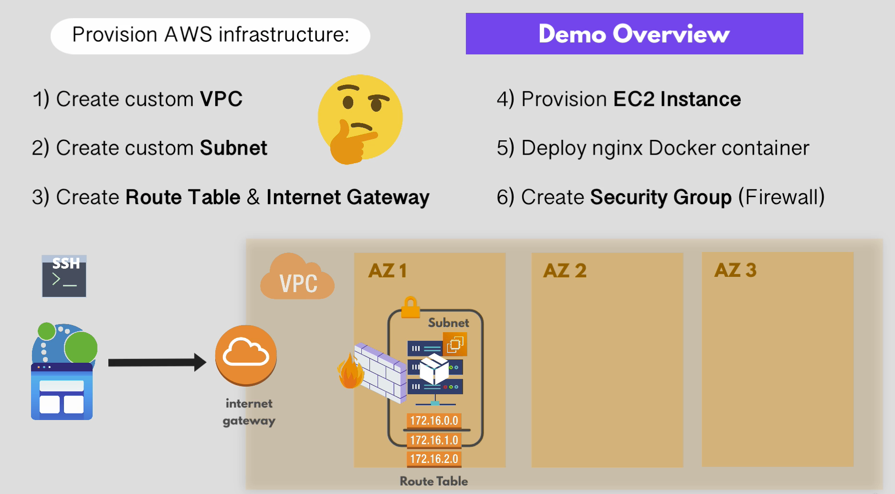

# Terraform Demo for Beginners 

In this project, we'll be implementing the following infrastructure AWS using Terraform:

<p align="center">
  
  <br/>
   <em> Demo Overview </em>
</p>
<br/><br/>


## Connecting to AWS
There are two ways you could connect Terraform to AWS:
### 1. Using ENV Variables:
```shell
$ export AWS_ACCESS_KEY_ID=<aws access key id>
$ export AWS_SECRET_ACCESS_KEY=<aws secret key>
```

### 2. One-time Configuration of AWS Credentials in your host (globally):
Install ```awsclie``` and run the following: 
```shell 
$ aws configure 
```

You'll then be provided with step-by-step instructinos to set your aws credentials. 
Terraform will automatically pick your credentials everytime you use it.

## Running & Building the Infrastructure in AWS
 1. Initializing a new terraform project via running the following command from the tf dir:
    ```shell
    $ tarraform init
    ```
2. Preview the execution plan and changes (optional):
    ```shell
    $ terraform plan
    ```
3. Apply the changes:
    ```shell
    $ terraform apply
    ```

    